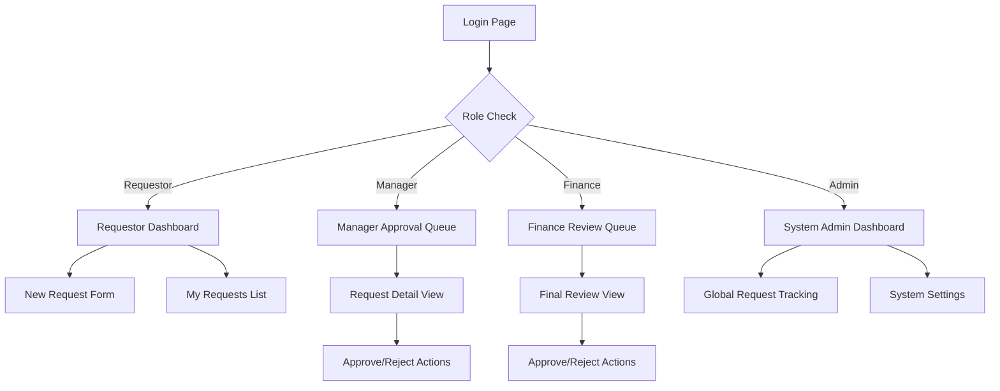

## 📂 Project Structure

```
projects/
├── server/                      # .NET 8 Backend
│   ├── API/                     # Presentation: Controllers, Middleware, API Services
│   ├── Application/             # Logic: Services, DTOs, Mappings, Interfaces
│   ├── Domain/                  # Core: Entities
│   ├── Infrastructure/          # Data: DbContext, Repositories, UnitOfWork, Auth Services
│   ├── Shared/                  # Cross-cutting: Enums, Exceptions, Shared Models
│   └── Server.sln               # Solution file
│
├── client/                      # Angular Monorepo (Nx, Angular 21+)
│   ├── apps/
│   │   └── admin-panel/         # Main Management Portal (Standalone)
│   ├── libs/
│   │   └── core-shared/         # Shared State, SignalR & API Services
│   ├── nx.json                  # Nx Orchestration
│   └── package.json             # Workspace Dependencies
│
└── README.md
```

### 🗺️ User Workflow & UI Diagram

The application follows a modern, role-based navigation flow with dedicated dashboards for each user role.



### Backend Clean Architecture

```
server/
├── API/                         # Presentation Layer
│   ├── Controllers/             # API Endpoints
│   ├── Middleware/              # Custom Middleware (Exception, Auth)
│   └── Services/                # API-specific services (Swagger, Filters)
│
├── Application/                 # Business Logic Layer
│   ├── DTOs/                    # Data Transfer Objects
│   ├── Interfaces/              # Service & Repository Interfaces
│   ├── Mappings/                # AutoMapper Profiles
│   └── Services/                # Application Services (Business Logic)
│
├── Domain/                      # Domain Layer (Enterprise Logic)
│   └── Entities/                # Core Entities (BaseEntity, Identity)
│
├── Infrastructure/              # Data Access & External Services
│   ├── Persistence/             # Data (AppDbContext, UoW), Repositories, Seeds
│   ├── Extensions/              # Service Registrations (Dependency Injection)
│   └── Services/                # External Service Implementations (Authentication)
│
└── Shared/                      # Cross-cutting: Enums, Exceptions, Shared Models
```

### Frontend Monorepo Structure

```
client/
├── apps/
│   └── admin-panel/             # Enterprise Admin Portal
│       ├── src/app/
│       │   ├── core/            # Guards, Interceptors, Auth
│       │   ├── features/        # Business logic (Dashboard, Sponsorships)
│       │   └── shared/          # App-specific UI Components
│       └── project.json         # Nx Project Config
│
├── libs/
│   └── core-shared/             # Cross-app Shared Library
│       ├── src/lib/
│       │   ├── services/        # Real-time Services (SignalR)
│       │   ├── state/           # Global Signals, Store
│       │   └── models/          # Shared Interfaces
│
└── nx.json                      # Build & Dependency Graph Config
```

---

## 🚀 Getting Started

### Prerequisites
- .NET 8 SDK
- Node.js 18+ & NPM
- PostgreSQL (or use the provided Neon connection string)

### 1. Backend Setup
1. Navigate to `server/src/API`.
2. Update `appsettings.json` with your database connection string.
3. Run migrations: `dotnet ef database update`.
4. Run the app: `dotnet watch run`.
5. Access Swagger at `http://localhost:5081/swagger`.

### 2.1. Frontend Setup
1. Navigate to `client`.
2. Install dependencies: `npm install`.
3. Run the admin panel: `npx nx serve admin-panel`.
4. Access the app at `http://localhost:4200`.

### 2.2. Production Compilation
1. Navigate to `client`.
2. Command: npx nx build admin-panel --configuration=production
3. Shorthand: npx nx build admin-panel -c production

### 3. Db Setup
1. Navigate to `server/src/API`.
2. Update `appsettings.json` with your database connection string.
3. Run migrations: `dotnet ef database update`.
4. Run the app: `dotnet watch run`.

### 4. Test Credentials
| Role | Email | Password |
| :--- | :--- | :--- |
| **Requestor** | `requestor@techzu.com` | `Requestor123!` |
| **Manager** | `manager@techzu.com` | `Manager123!` |
| **Finance Admin** | `finance@techzu.com` | `Finance123!` |
| **System Admin** | `admin@techzu.com` | `Admin123!` |

---

## 🏛️ Architecture Explanation

### Backend Architecture
The backend is built following **Clean Architecture** principles, ensuring separation of concerns and testability:
- **Domain Layer**: Contains core entities and enterprise logic (SponsorshipRequest, WorkflowHistory).
- **Application Layer**: Orchestrates business logic, containing interfaces, DTOs, and services.
- **Infrastructure Layer**: Handles data persistence (EF Core, Repository Pattern, Unit of Work) and external integrations.
- **API Layer**: Presentation layer containing REST controllers, custom middleware, and authentication logic.

### Frontend Structure
Built as an **Nx Monorepo** for scalability:
- **Apps**: Standalone Angular applications (admin-panel).
- **Libs**: Shared logic, state management, and models (`core-shared`) to promote code reuse.
- **Styling**: Standardized using **Bootstrap 5** for a responsive, accessible, and professional UI.

### Workflow & RBAC Logic
- **State Machine**: Implemented a robust workflow transition logic in the backend `SponsorshipService`. Transitions are strictly validated (e.g., a Requestor cannot approve their own request).
- **RBAC**: Integrated with **ASP.NET Core Identity**. Roles are embedded in the JWT claims and verified via `[Authorize(Roles = "...")]` attributes and custom route guards in Angular.
- **Audit Logging**: Every status change is automatically logged in the `WorkflowHistories` table, including the action taken, the performer, and optional remarks.

### Assumptions & Tradeoffs
- **Document Upload**: For this assessment, `documentUrl` is a text field. A full file upload system (e.g., Azure Blob Storage) was omitted to focus on the workflow logic within the 6-hour window.
- **Real-time Notifications**: While SignalR was considered, it was prioritized lower than the core workflow and audit history features.
- **Database**: Using PostgreSQL with the Repository pattern allows for easy switching to other relational databases like MySQL if needed.
